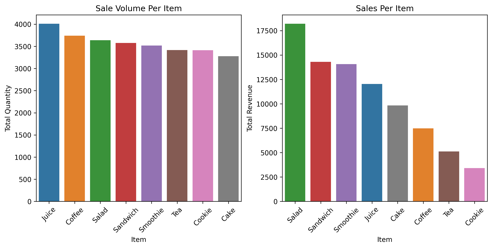
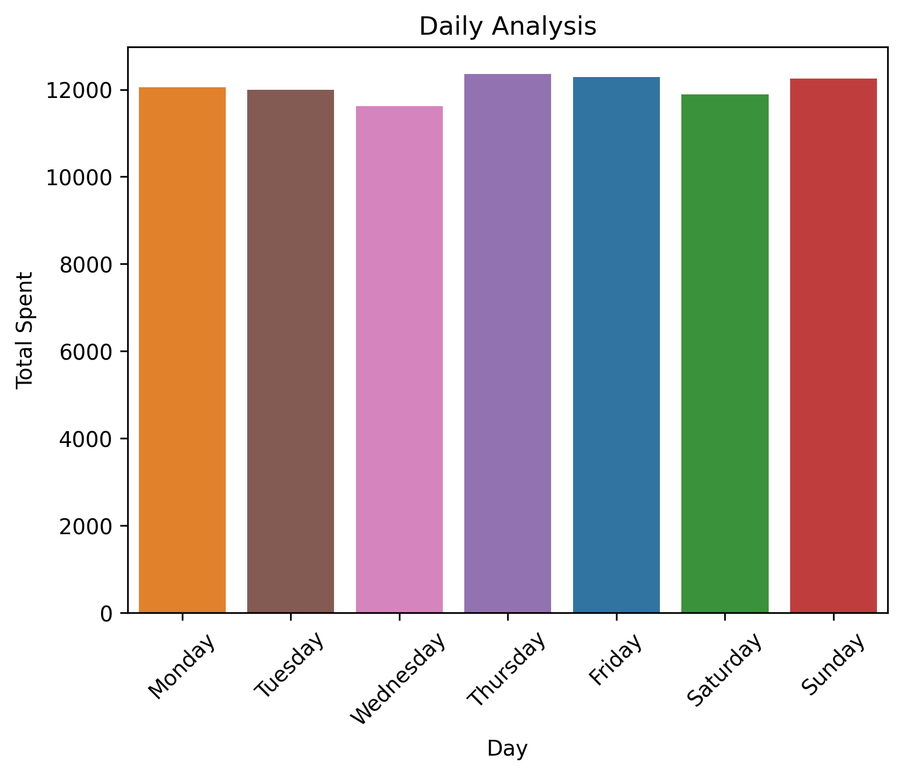
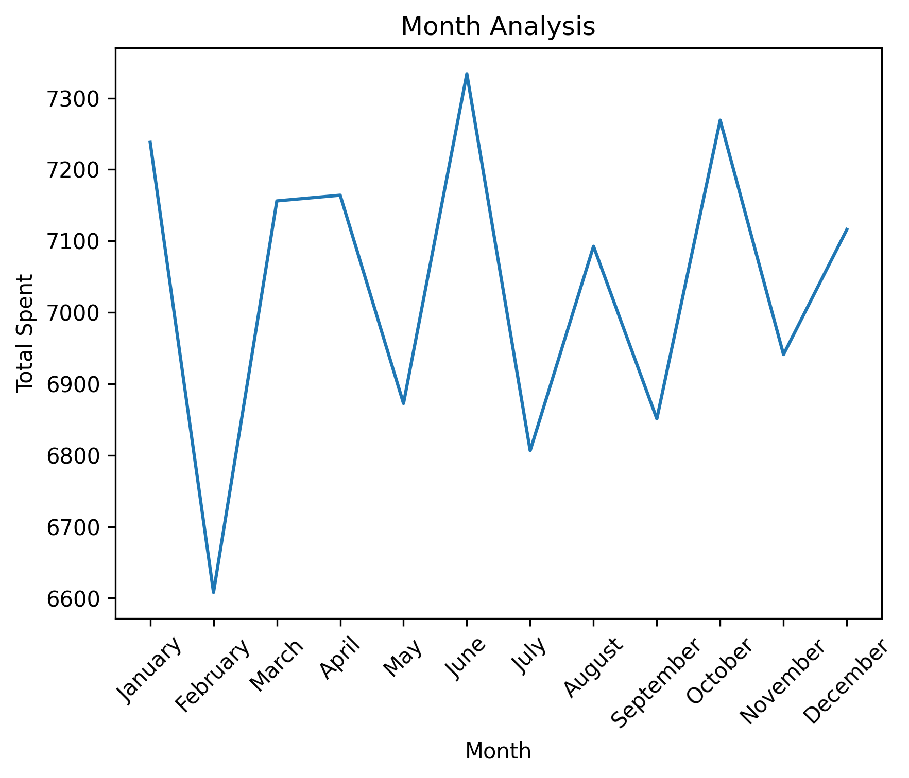
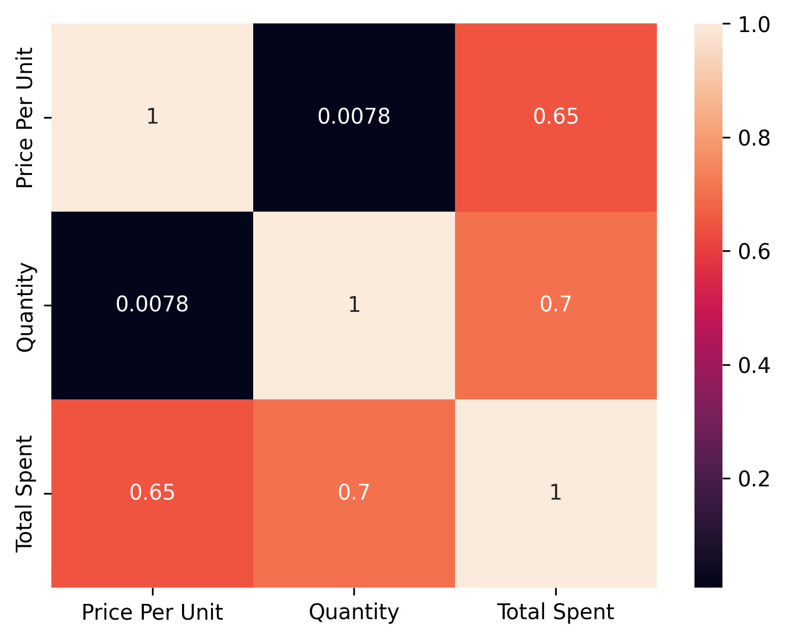

# ☕ Cafe Sales Data Cleaning & Exploratory Data Analysis

## Project Overview

This project focuses on cleaning, preprocessing, and analyzing a cafe sales dataset containing intentionally introduced data quality issues. The goal is to demonstrate practical data cleaning techniques, exploratory data analysis (EDA), and business insight generation using Python and Pandas.

## Dataset

**Source:**  
https://www.kaggle.com/datasets/ahmedmohamed2003/cafe-sales-dirty-data-for-cleaning-training

The dataset was designed specifically for practicing data cleaning and preprocessing workflows.

### Features

| Column | Description |
|----------|-------------|
| Transaction ID | Unique transaction identifier |
| Item | Purchased menu item |
| Quantity | Number of units purchased |
| Price Per Unit | Unit price of the item |
| Total Spent | Total transaction amount |
| Payment Method | Payment type used by the customer |
| Location | Store location |
| Transaction Date | Date of transaction |

---

## Project Objectives

- Identify and handle missing values
- Detect and resolve inconsistent records
- Perform data validation and cleaning
- Conduct exploratory data analysis
- Generate business insights from transaction data
- Visualize sales patterns and trends

---

## Technologies Used

- Python
- Pandas
- NumPy
- Matplotlib
- Seaborn
- Jupyter Notebook

---

## Data Cleaning Process

### Cleaning Steps Performed

- Converted data types to appropriate formats
- Parsed transaction dates into datetime format
- Handled missing values in Quantity, Price Per Unit, Total Spent, Payment Method, and Location
- Validated relationships between Quantity, Price Per Unit, and Total Spent
- Corrected missing values using business logic where possible
- Categorized unresolved missing values in Payment Method and Location as **Unknown**

---

## Exploratory Data Analysis

### Product Performance Analysis

Analyzed:

- Total quantity sold per item
- Total revenue generated per item
- Revenue contribution by product

### Time-Based Analysis

Investigated:

- Daily sales patterns
- Monthly sales trends
- Day-of-week revenue performance

### Correlation Analysis

Explored relationships between:

- Quantity
- Price Per Unit
- Total Spent

---

## Key Insights

The analysis of cafe sales data revealed several important business insights related to product performance, revenue distribution, and sales trends.

---

### Revenue vs Product Performance



- Salad generated the highest total revenue despite lower sales volume.
- Juice was the most frequently purchased item but did not generate the highest revenue.
-High-priced items (Salad, Sandwich, Smoothie) contributed disproportionately to overall revenue.

---

### Sales Volume Distribution



- Sales show noticeable fluctuations across different days.
- Certain days consistently show higher customer activity, indicating peak business periods.
- Stable baseline demand is observed throughout the dataset.

---

### Monthly Sales Trends



- Sales remained relatively stable throughout the year.
- June and October recorded the strongest performance months.
- February showed the lowest sales activity, indicating a seasonal dip.

---

### Feature Relationships (Correlation)



- Strong positive correlation exists between Quantity and Total Spent.
- Price Per Unit significantly influences revenue generation.
- No strong negative correlations were observed, indicating consistent purchasing behavior.

---

## Business Summary

- Revenue is driven more by high-value items than high-volume items
- Customer demand is consistent but slightly seasonal
- A small number of products contribute to a large portion of revenue (Pareto-like effect)
- Optimizing pricing strategy for high-value items can significantly impact revenue growth

---

## Project Structure

```text
project/
│
├── images/
│   ├── correlation.png
│   ├── daily_sales.png
│   ├── monthly_sales.png
|   └── product_performance.png
│
├── Cafe_Sales_Data_Cleaning_EDA.ipynb
└── dirty_cafe_sales.csv
└── README.md
```

---

## Skills Demonstrated

- Data Cleaning
- Data Validation
- Missing Value Treatment
- Exploratory Data Analysis
- Data Visualization
- Feature Engineering
- Business Insight Generation
- Pandas Data Manipulation
- Statistical Interpretation
